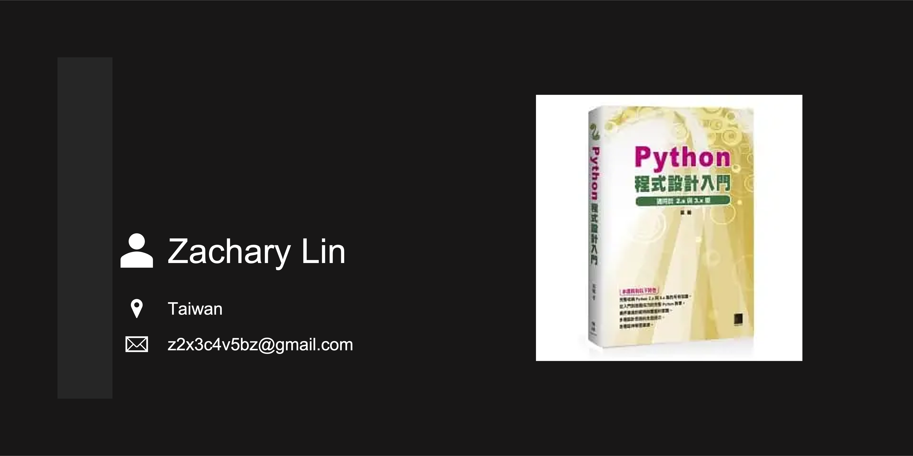

# Python 程式設計入門（習題個人解答） #

[](https://github.com/z2x3c4v5bz/Learning--Py_intro/discussions)
[](https://github.com/z2x3c4v5bz/Learning--Py_intro/network)
[](https://github.com/z2x3c4v5bz/Learning--Py_intro/stargazers)
[](https://github.com/z2x3c4v5bz/Learning--Py_intro/releases)
[](https://github.com/z2x3c4v5bz/Learning--Py_intro/blob/master/LICENSE)

## Abstract ##

**Title:** Python 程式設計入門

**Auther:** 葉難

**Publisher:** 博碩文化股份有限公司

**Introduction:**

>- 完整收納 Python 2.x 與 3.x 版的所有知識
>- 從入門到進階技巧的完整 Python 教學
>- 循序漸進的範例與豐富的習題
>- 多種設計思路的全面提示
>- 各種延伸學習資源



※ 習題開發環境為 Python 3.x，作業系統使用 Microsoft Windows 7/10/11 x64 與 Apple macOS Monterey，並選擇軟體 VS Code 為文字編輯器。

※ 原諒我題目內不附圖示。

※ 請留意，文中數學公式在瀏覽器頁面中可能無法正確顯示。

※ 圖書封面、圖書資訊、章節內容、習題皆為版權作者、出版商所有，本站所刊內容僅供教育、學習使用。

## Table of Contents ##

- [Python 程式設計入門（習題個人解答）](#python-程式設計入門習題個人解答)
  - [Abstract](#abstract)
  - [Table of Contents](#table-of-contents)
  - [Chapter 01 -- 走入 Python 的世界](#chapter-01----走入-python-的世界)
  - [Chapter 02 -- 開始撰寫 Python 程式](#chapter-02----開始撰寫-python-程式)
  - [Chapter 03 -- 數值型別](#chapter-03----數值型別)
  - [Chapter 04 -- 序列型別與迭代](#chapter-04----序列型別與迭代)
  - [Chapter 05 -- 字典與集合](#chapter-05----字典與集合)
  - [Chapter 06 -- 函式](#chapter-06----函式)
  - [Chapter 07 -- 檔案、文字、編碼、位元組資料](#chapter-07----檔案文字編碼位元組資料)
  - [Chapter 08 -- 其他容器型別](#chapter-08----其他容器型別)
  - [Chapter 09 -- 再談函式](#chapter-09----再談函式)
  - [Chapter 10 -- 模組](#chapter-10----模組)
  - [Chapter 11 -- 物件導向程式設計（OOP）](#chapter-11----物件導向程式設計oop)
  - [Chapter 12 -- 異常（exception）](#chapter-12----異常exception)
  - [Chapter 13 -- 延伸學習](#chapter-13----延伸學習)

## Chapter 01 -- 走入 Python 的世界 ##

>- 電腦、軟體與程式語言
>- Python 簡介
>- 版本
>- Python 程式執行環境與實作
>- 安裝 Python 實作
>- Hello Python
>- 程式碼編輯器與 IDE

[](#table-of-contents)

## Chapter 02 -- 開始撰寫 Python 程式 ##

>- 名稱、物件、型別、指派
>- 運算式
>- 述句
>- 函式
>- 模組
>- 原始程式檔
>- 常見錯誤
>- 補充

### Ch02 Note ###

- 「//」表示地板除法（floor division），結果為比它小、最靠近它的整數。
- 「%」餘數運算子在有負數運算的情況下，`x % y` 的行為等於 `x - (x // y) * y`。
- 於程式第一行或第二行標示編碼 `# -*- coding: utf-8 -*-`。

### [Question 02-01](ch02/ch02_01/ch02_01.py) ###

>閏年規則如下，西元年份可被 400 整除是閏年，或者，可被 4 整除但不能被 100 整除的年份也是閏年。例如 2000 與 2060 是閏年，1900 與 2057 不是閏年。請依此規則寫出 `if` 述句判斷某整數（西元年份）是否為閏年。

### [Question 02-02](ch02/ch02_02/ch02_02.py) ###

>分別用 `for` 與 `while` 述句印出九九乘法表。

### [Question 02-03](ch02/ch02_03/ch02_03.py) ###

>程式碼 2.9（ch02_score_plus.py）使用 `continue` 述句，請改寫，去掉 `continue` 述句，但仍保持相同的功能。

### [Question 02-04](ch02/ch02_04/ch02_04.py) ###

>請寫出攝氏溫度轉華氏溫度的函式，以及華氏轉攝氏的函式。

### [Question 02-05](ch02/ch02_05/ch02_05.py) ###

>請寫個函式，參數是三個數字，找出其中較大的兩個，並算出平方和回傳。例：參數 `2`、`3`、`4`，回傳 $3^2 + 4^2$。

### [Question 02-06](ch02/ch02_06/ch02_06.py) ###

>給兩個整數，求出最小公倍數。

### [Question 02-07](ch02/ch02_07/ch02_07.py) ###

>串列裡含有由小到大排列好的整數，數字可能重複，例如 `[0, 1, 1, 2, 3, 4, 5, 5, 9, 9, 9, 23, 25, 25, 25]`，請撰寫函式找出重複最多次的整數，若重複次數相等則回傳值較小的，以此例而言，9 與 25 都重複 3 次，應回傳 `9`。

### [Question 02-08](ch02/ch02_08/ch02_08.py) ###

>給你兩個日期，請算出相差幾天。日期以串列表示，譬如 2014 年 11 月 12 日是 `[2014, 11, 12]`。

### [Question 02-09](ch02/ch02_09/ch02_09.py) ###

>$n$ 階乘（$n!$）等於「$1 × 2 × 3 × ... × (n - 1) × n$」。請撰寫函式，參數是 $n$，算出 $n!$ 的所有位數的和。譬如 $9!$ 是 362880，而 $3 + 6 + 2 + 8 + 8 + 0$ 等於 27。

### [Question 02-10](ch02/ch02_10/ch02_10.py) ###

>給定兩個串列，裡頭各有一些數字（整數），找出兩個串列都有的數字。

[](#table-of-contents)

## Chapter 03 -- 數值型別 ##

>- 整數（int）與浮點數（float）
>- 範例：平方根
>- 布林
>- 物件、型別、方法
>- 複數（complex）
>- 轉型
>- 十進位數（Decimal）
>- 分數（Fraction）
>- 位元運算

### Ch03 Note ###

- 浮點數（float）數值不應直接拿來做比較。

### [Question 03-01](ch03/ch03_01/ch03_01.py) ###

>圓形面積是圓的半徑平方再乘上圓周率，請撰寫函式，傳入半徑，回傳圓面積。

### [Question 03-02](ch03/ch03_02/ch03_02.py) ###

>曾經有一款遊戲，其角色能力值的上下限是 0 到 255，現在想要將能力值上下限轉換為大眾熟悉的 0 到 100。請撰寫函式進行轉換，其中 200～255（良好）應該轉換到 85～100，0～130（差勁）應轉換到 0～60。

### [Question 03-03](ch03/ch03_03/ch03_03.py) ###

>當給定一個正整數時，把每個位數加起來，其和若可被 3 整除，則原數也可被 3 整除，同樣的原理可依此類推，直到最後得到的和可被 3 整除。譬如 37524，$3 + 7 + 5 + 2 + 4$ 等於 21，$2 + 1$ 等於 3，所以 21 可被 3 整除，所以 37524 也可被 3 整除。請撰寫函式，根據此法判斷參數是否可被 3 整除。

### [Question 03-04](ch03/ch03_04/ch03_04.py) ###

>考拉茲猜想（Collatz conjecture），又稱為奇偶歸一猜想；給定一正整數，若是偶數就除以 2，若是奇數就乘 3 再加 1，如下：
>
>$f(n) = \frac{n}{2}$ ，若 $n$ 是偶數
>
>$f(n) = 3n + 1$ ，若 $n$ 是奇數
>
>如此不斷重複，最終必得到 1。譬如給定 6 的話，將會依序得到 3、10、5、16、8、4、2、1。但這僅為猜想而已，尚無人可證明。請撰寫程式，驗證介於 1 到 10000 之間的正整數，都符合此猜想。

### [Question 03-05](ch03/ch03_05/ch03_05.py) ###

>若一個整數除了自己與 1 以外，不能被其他數整除，就稱為質數，例如 2、3、5、7、11。請撰寫函式，參數是個整數，回傳布林值代表它是不是質數。

### [Question 03-06](ch03/ch03_06/ch03_06.py) ###

>神秘的 1089。三位數的整數，百位數與個位數必須相差 2 以上，假定原數字是 ABC，反轉後得到 CBA，讓大的減去小的，得到 DEF，再反轉得到 FED，而相加後「DEF + FED」一定會等於 1089。譬如 $732 - 237$ 等於 495，$495 + 594$ 等於 1089；讀者可試試 654 與 123。請問是否所有符合條件的三位數整數，都會得到 1089。

### [Question 03-07](ch03/ch03_07/ch03_07.py) ###

>計算 $n$ 階乘（$n!$）時，當 $n$ 很大時計算量非常龐大，若情況許可，可使用斯特靈公式（Stirling's approximation）取得近似值，公式如下，請撰寫實作此公式的函式。
>
>$$n! \approx \sqrt{2 \pi n}(\frac{n}{e})^n$$

### [Question 03-08](ch03/ch03_08/ch03_08.py) ###

>三個正整數 a、b、c，若能符合下列公式，便可稱為卡達諾三數組（Cardano Triplet），譬如 2、1、5。當 $a + b + c \le 1000$ 時，共存在著 149 個卡達諾三數組，請找出來。
>
>$$\sqrt[3]{a + b \sqrt{c}} + \sqrt[3]{a - b \sqrt{c}} = 1$$

### [Question 03-09](ch03/ch03_09/ch03_09.py) ###

>「幾 A 幾 B 猜數字」規則如下，甲方在心中設想一個四位數的數字，位數不重複，由乙方來猜，甲方需回答「幾 A 幾 B」，A 代表位置正確的位數的個數，B 代表數字正確但位置不對的個數，舉例而言，若正確答案是 5234，那麼猜 5346 會得到 1A2B。請寫出函式，參數是正確答案與猜測，回傳 `tuple`，第 0 個元素代表 A、第一個元素代表 B。

### [Question 03-10](ch03/ch03_10/ch03_10.py) ###

>終極密碼戰遊戲的玩法如下，由電腦從 1 到 100 選出一個數字當作謎底，然後由使用者猜謎底，若沒猜中就縮減邊界（往較小的方向縮減），然後繼續猜。舉例而言，假設謎底是 23，而使用者猜 44 沒猜中，那麼邊界就從 1～100 縮減到 1～44，然後使用者再猜 12 沒猜中，邊界從 1～44 縮減到 12～44，直到猜中為止。請寫支程式，讓電腦隨機從 1 到 100 選出謎底，由你來猜，看看需要猜幾次。

### [Question 03-11](ch03/ch03_11/ch03_11.py) ###

>假定參數是兩個 32 位元整數 A 與 B，請判斷需要改變幾個位元，才能把整數 A 轉換成整數 B。範例：A 是 31（`0b11111`），B 是 14（`0b1110`），答案是 2。

### [Question 03-12](ch03/ch03_12/ch03_12.py) ###

>假定整數有 32 位元，請把其中奇數位元與偶數位元互換，也就是說，第 0 個位元與第 1 個位元互換，第 2 個與第 3 個位元互換，依此類推，只能使用位元運算子，使用次數越少越好。

[](#table-of-contents)

## Chapter 04 -- 序列型別與迭代 ##

>- 型別與物件
>- 抽象型別
>- 元素存取
>- 迭代
>- 串列生成式（list comprehension）
>- 字串

### Ch04 Note ###

- 串列生成式（list comprehension）：`[<運算式> for <變數名稱> in <可迭代項目>]`、`[<運算式> for <變數名稱> in <可迭代項目> if <條件>]`。

### [Question 04-01](ch04/ch04_01/ch04_01.py) ###

>串列中有一堆數字，譬如 `[9, 5, 5, -4, 7, 6, 4, 1, -2, 0, 10, 9, 7]`，請找出其中只出現過一次的數字。

### [Question 04-02](ch04/ch04_02/ch04_02.py) ###

>請撰寫函式，參數是串列與正整數 $n$，以 $n$ 個元素為單位切割串列。例如傳入 `[0, 1, 2, 3, 4, 5, 6, 7, 8, 9]` 與 3，會回傳 `[[0, 1, 2], [3, 4, 5], [6, 7, 8], [9]]`。請試著先以迴圈來實作，然後以串列生成式撰寫。

### [Question 04-03](ch04/ch04_03/ch04_03.py) ###

>請撰寫函式，參數是個串列，裡頭都是整數，回傳串列的元素是原本的元素加上索引值後的整數。例：傳入 `[8, 4, 1, 7]`，回傳 `[8 + 0, 4 + 1, 1 + 2, 7 + 3]`，也就是 `[8, 5, 3, 10]`。

### [Question 04-04](ch04/ch04_04/ch04_04.py) ###

>字串 `s = 'abcde'`，請問只使用切片的話，是否能夠反轉字串，也就是以 `s[i:j:k]` 得到 `'edcba'`，若明確指定 $i$、$j$、$k$ 的值，做得到嗎？

### [Question 04-05](ch04/ch04_05/ch04_05.py) ###

>串列中每一個元素都是一筆個人資料，例如 `[('John', 40, 174, 65), ('Amy', 28, 165, 44), ('Jessie', 32, 158, 45)]`，個人資料依序是姓名、年齡、身高、體重，請使用內建函式 `sorted`，按照年齡排序。

### [Question 04-06](ch04/ch04_06/ch04_06.py) ###

>本章實作了累和 `cumulative_sum`，請實作「累積（累乘）」 `cumulative_product`。若傳入串列 `[a, b, c, ...]`，回傳 `[a, a * b, a * b * c, ...]`。

### [Question 04-07](ch04/ch04_07/ch04_07.py) ###

>程式碼 4.8（ch04_group.py）把傳入的參數（可迭代者）轉成串列，請以別種做法實作出相同的功能。

### [Question 04-08](ch04/ch04_08/ch04_08.py) ###

>撰寫函式，參數是個含有某班級學習成績的串列，請挑出不及格（低於 60 分）的成績，放在新串列內、然後回傳。請分別使用迴圈、串列生成式撰寫。

### [Question 04-09](ch04/ch04_09/ch04_09.py) ###

>2.x 版的內建函式 `range` 根據參數建立出串列，串列元素是整數，請撰寫類似的函式，改為接受字串（僅含一個字元）為參數，建立出含字串的串列。`rangeStr('f')` 會回傳 `['a', 'b', 'c', 'd', 'e']`，`range('i', 'l')` 會回傳 `['i', 'j', 'k']`，`range('a', 'f', 2)` 會回傳 `['a', 'c', 'e']`。

### [Question 04-10](ch04/ch04_10/ch04_10.py) ###

>矩陣可由二維串列來表示，每個子串列代表矩陣中的一列，譬如下列的 $4 × 3$ 矩陣會是 `[[9, 13, 5], [1, 11, 7], [3, 9, 2], [6, 0, 7]]`，請撰寫函式實作矩陣乘法，參數有兩個，$m × n$ 矩陣與 $n × p$ 矩陣。
>
>$$
>\begin{bmatrix}
>   9   &   13    &   5\\
>   1   &   11    &   7\\
>   3   &    9    &   2\\
>   6   &    0    &   7\\
>\end{bmatrix}
>$$

### [Question 04-11](ch04/ch04_11/ch04_11.py) ###

>撰寫函式建立二維串列，參數有三個，代表列、欄、初始值，譬如若傳入 2、3、None，應建立 `[[None, None, None], [None, None, None]]`。

### [Question 04-12](ch04/ch04_12/ch04_12.py) ###

>多項式函數如下，我們能以 `list` 來表示，在索引值（代表次數）的地方儲存係數，請撰寫函式，參數有兩個，一個是表示多項式的 `list`，一個是 $x$ 的值，代入 $x$ 後，計算出多項式函數的值，然後回傳。
>
>$$a_n x^n + a_{n - 1} x^{n - 1} + ... + a_2 x^2 + a_1 x + a_0$$

### [Question 04-13](ch04/ch04_13/ch04_13.py) ###

>學校老師需要設計關於有限小數的題目，因為浮點數型別 `float` 的特性，並不適合，請問該怎麼使用模組 `decimal`，可讓老師輸入某運算式，便可得到適當形式的答案。譬如想算半徑 0.1 的圓面積，假定圓周率是 3.14，輸入「3.14\*0.1\*0.1」希望得到 `0.0314`，而不是 `0.031400000000000004`。

### [Question 04-14](ch04/ch04_14/ch04_14.py) ###

>學校老師需要設計關於分數（分母、分子）的題目，因為浮點數型別 `float` 的特性，並不適合，請問該怎麼使用模組 `fractions`，可讓老師輸入某運算式，便可得到適當形式的答案。譬如想算 $\frac{\frac{1}{6}}{\frac{1}{4}}$，希望得到 `2/3`。

### [Question 04-15](ch04/ch04_15/ch04_15.py) ###

>'e.g.' 是拉丁文 "exempligratia" 的縮寫，意思是「for instance、for example」，也就是「例如、舉例來說」，但常有人誤寫成 'e.x.'、'ex.'、'eg.'，請撰寫函式，傳入字串（句子），修正此錯誤。
>
>例如應把 'I love animals, e.x., dogs, birds and cats.' 改成 'I love animals, e.g., dogs, birds and cats.'。
>
>但是 'ex.' 也常當作「example（範例）」的縮寫，所以若是 'ex.1' 或 'ex. 2'，就不應該更改。例如 'Please take a look at Ex. 1'，就毋須修正。

### [Question 04-16](ch04/ch04_16/ch04_16.py) ###

>迴文（palindrome）是個正念反念都一樣的句子（或是單字、片語），請撰寫函式判斷參數（字串）是不是迴文。
>
>迴文範例："race car"、"Amor, Roma"、"No 'x' in Nixon"、"A man, a plan, a canal, Panama!"。

### [Question 04-17](ch04/ch04_17/ch04_17.py) ###

>在英文裡，含有全部 26 個字母的句子叫做全字母句（pangram）。請撰寫函式判斷參數（字串）是不是全字母句。
>
>全字母句範例：
>
>'The quick brown fox jumps over the lazy dog.'
>
>'Does the quick brown fox jump over the lazy dog?'
>
>'Do big jackdaws love my sphinx of quartz?'

### [Question 04-18](ch04/ch04_18/ch04_18.py) ###

>迴文數是種對稱的數字，譬如 11、101、151、484、10201，每個位數按相反順序重新排列後，結果會跟原來的數字一樣。請撰寫函式判斷參數（正整數）是否為迴文數。另外，請計算 $n$ 位數中有幾個迴文數，譬如 2 位數中有 9 個迴文數，3 位數中有 90 個，4 位數中有 90 個。

[](#table-of-contents)

## Chapter 05 -- 字典與集合 ##

>- 字典與集合的基礎
>- 相關抽象型別
>- 字典
>- 集合
>- 補充

### [Question 05-01](ch05/ch05_01/ch05_01.py) ###

>請建立字典，鍵是代表月份的整數 1 到 12，值是該月的英文（January、February 等）。假設字典名為 `d`，那麼 `d[9]` 應得到 `'September'`。

### [Question 05-02](ch05/ch05_02/ch05_02.py) ###

>字典裡含有公司名與股票價值，請建立新字典，僅包含價值超過 100 的項目。分別運用 `for` 迴圈與字典生成式來實作。
>
>```Python
>stock = {
>  'Apple': 655.95, 'IBM': 202.13, 'HP': 45.51, 'Facebook': 12.11, 'Intel': 40.51, 'Atmel': 10.23, 'Amazon': 305.35, 'Google': 535.81
>}
>```

### [Question 05-03](ch05/ch05_03/ch05_03.py) ###

>凱薩密碼（Caesar cipher）是種非常簡單的加密法，規則如下：如果是「+4」，代表「向右移 4」，那麼字母 a 會變成 e、f 變成 j，抵達盡頭時便會繞捲回到另一端，所以 x 會變成 b；如果是「-3」代表「向左移3」，那麼 f 會變成 c、e 變成 b、a 變成 x。請撰寫韓式，參數是介於 1 到 25 之間的整數，回傳可用來進行凱薩密碼轉換的字典，譬如若傳入 13，那麼應該回傳如下的字典：
>
>```Python
>{'a': 'n', 'b': 'o', 'c': 'p', 'd': 'q', 'e': 'r', 'f': 's', 'g': 't', 'h': 'u', 'i': 'v', 'j': 'w', 'k': 'x', 'l': 'y', 'm': 'z', 'n': 'a', 'o': 'b', 'p': 'c', 'q': 'd', 'r': 'e', 's': 'f', 't': 'g', 'u': 'h', 'v': 'i', 'w': 'j', 'x': 'k', 'y': 'l', 'z': 'm', 'A': 'N', 'B': 'O', 'C': 'P', 'D': 'Q', 'E': 'R', 'F': 'S', 'G': 'T', 'H': 'U', 'I': 'V', 'J': 'W', 'K': 'X', 'L': 'Y', 'M': 'Z', 'N': 'A', 'O': 'B', 'P': 'C', 'Q': 'D', 'R': 'E', 'S': 'F', 'T': 'G', 'U': 'H', 'V': 'I', 'W': 'J', 'X': 'K', 'Y': 'L', 'Z': 'M'}
>```

### [Question 05-04](ch05/ch05_04/ch05_04.py) ###

>本章最後介紹了 `defaultdict`，寫了幾支範例，請你使用一般的 `dict` 改寫。

### [Question 05-05](ch05/ch05_05/ch05_05.py) ###

>檔案 ch05ex5.5.py 裡含有一個串列，每個元素是個字典，含有朋友的資料，包括名（first name）、姓（last name）、email。如下：
>
>```Python
>friends = [
>  {'first': 'Amy', 'last': 'Wallace', 'email': 'plunk@service.com.ru'},
>  {'first': 'Jhon', 'last': 'Dickson', 'email': 'john@edu.com.ru'},
>  {'first': 'Amy', 'last': 'Obama', 'email': 'amy@whitehouse.gov'},
>  # ...省略...
>]
>```
>
>請先按照「名」排序，若同名則按照「姓」排序，譬如 Amy Obama 應排在 Amy Wallace 之前。

### [Question 05-06 (unfinished)](ch05/ch05_06/ch05_06.py) ###

>檔案 ch05ex5.6.py 裡有個很長的字串，節錄自 Martin Luther King, Jr. 的著名演講「I Have a Dream」。請撰寫程式統計英文單字出現的次數，結果是個字典，鍵是英文單字，值是次數，譬如 `{'dream': 6, 'have': 5}`。
>
>然後便可分析並統計資料，包括：總共有幾個單字、出現次數最多（與最少）的前五名、前幾名的次數加起來會佔總次數的 60%、哪個長度的單字出現次數最多、單字平均長度、只出現一次的單字有哪些。統計時應忽略大小寫，所以 'Have' 與 'have' 應視為同樣的單字。
>
>註：目前直接把文章內容放在程式碼裡，之後第 7 章便會介紹如何開啟檔案並讀寫。

### [Question 05-07 (unfinished)](ch05/ch05_07/ch05_07.py) ###

>檔案 ch05ex5.6.py 裡有很長的字串，記錄著工作記錄，包括日期、工人名字、採收水果種類、採收數量，一筆工作記錄佔一行，紀錄中每個項目會以逗號隔開；另外有個字典，其中含有採收一個水果的工錢，如下所示：
>
>```Python
>date = {"""
>2014/05/06, Amy, apple, 50,
>2014/05/06, Bob, banana, 35,
># ...省略...
>2014/05/10, Amy, grape, 23,
>2014/05/10, David, apple, 11,
>"""}
>
>prices = {'apple': 30, 'banana': 22, 'grape': 25}
>```
>
>例如 2014 年 5 月 6 日，Amy 採收了蘋果 50 個，而蘋果採收一個的工錢是 30 元，所以 Amy 在那一天賺了 1500 元。請撰寫程式，按總工資多寡排列工人名字。

### [Question 05-08](ch05/ch05_08/ch05_08.py) ###

>撰寫韓式，參數是個含有英文單字（字串）的串列，請找出同為重組字的字串，分開存放。重組字（anagram）的定義請見第 4 章。可試著運用型別 `set` 來解題，或使用內建函式 `hash`。
>
>範例：若參數是 `['eat', 'ate', 'done', 'tea', 'opus', 'soup', 'node', 'quick']`，函式應回傳 `[['eat', 'ate', 'tea'], ['done', 'node'], ['opus', 'soup'], ['quick']]`。

### [Question 05-09 (unfinished)](ch05/ch05_09/ch05_09.py) ###

>稀疏矩陣（sparse matrix）中，多數元素的值為 0。若以二維陣列表示，當矩陣很大時，將會浪費許多空間，可試著以字典來表示，只記錄值非 0 的元素，譬如以字典 `{(0, 3): 1, (2, 1): 2, (4, 3): 3}` 來表示圖 5.7 的稀疏矩陣，鍵是含有列與欄的 `tuple`，值則是矩陣元素。請撰寫函式，傳入兩個代表稀疏矩陣的字典，實作矩陣乘法。
>
>$$
>\begin{bmatrix}
>   0   &   0   &   0   &   1   &   0\\
>   0   &   0   &   0   &   0   &   0\\
>   0   &   2   &   0   &   0   &   0\\
>   0   &   0   &   0   &   0   &   0\\
>   0   &   0   &   0   &   3   &   0\\
>\end{bmatrix}
>$$

### [Question 05-10](ch05/ch05_10/ch05_10.py) ###

>除了以埃氏篩法來產生含有質數的集合，還有其他方式。一個數若不能被比它小的任何質數整除，那麼它就是質數；以 11 為例，比它小的質數有 2、3、5、7，這些數都不能整除 11，所以 11 是質數。我們可以從質數 2 開始，先放進集合內，然後檢查下一個數字 3，3 不能被集合內的任何數字整除，所以是質數、放進集合內。然後檢查下一個數字 4，4 可被集合內的數字 2 整除，所以不是質數，依此類推，便可逐一將質數放進集合裡。
>
>請根據上述方式實作函式，參數是正整數 $n$ ，回傳含有 2 到 $n$ 之間的質數的集合。

[](#table-of-contents)

## Chapter 06 -- 函式 ##

>- 函式基礎
>- 參數
>- 可視範圍與命名空間
>- 遞迴
>- 高階函式
>- 產生器（generator）
>- 補充

### [Question 06-02] ###

>請撰寫函式，可接受任意數量的參數，回傳參數的數量。

### [Question 06-03] ###

>關鍵字參數之後不能有位置參數，所以底下的函式呼叫會出錯：
>
>```Python
>>>> def f(x, y, z): print(x, y, z)
>...
>>>> f(1, y=2, 3)
>  File "<stdin>", line 1
>SyntaxError: non-keyword arg after keyword arg
>```
>
>但關鞬字參數之後可以跟著「星號＋實際參數（可迭代者）」。請問底下這些函式呼叫，哪些可執行？執行結果又為何？
>
>```Python
>def f(x, y, z): print(x, y, z)
>f(z=3, *range(1), y=2)
>f(1, y=2, *range(1))
>f(z=3, *range(2))
>f(z=3, *range(3))
>f(1, *range(2), 3)
>f(1, *range(2), z=3)
>```
>
>注意：雖然「星號＋實際參數（可迭代者）」可出現在關鍵字參數之後，但其實它會先被處理，然後才輪到關鍵字參數與雙星號「**」（如果有的話）。

### [Question 06-04] ###

>若串列中的元素是長度為 1 的字串，而且可重複出現，例如 `['a', 'z', 'a', 'c', 'd', 'e', 'f', 'm', 'c', 'c']`，請撰寫函式，傳入此種串列，回傳串列的元素（tuple）含有字串與出現次數，並按照出現次數多寡排序，以此例而言是 `[('c', 3), ('a', 2), ('f', 2), ('z', 1), ('d', 1), ('e', 1), ('m', 1)]`。

### [Question 06-05] ###

>列欄數目相同的矩陣稱為方陣，可由二維串列來表示，每個子串列代表矩陣中的一列，例如 $4 × 4$ 方陣 `[[9, 13, 5, 2], [1, 11, 7, 3], [3, 9, 2, 1], [6, 0, 7, 19]]`。請撰寫函式，讓方陣旋轉 90 度，以此例而言，會變成 `[[9, 1, 3, 6], [13, 11, 9, 0], [5, 7, 2, 7], [2, 3, 1, 19]]`。

### [Question 06-06] ###

>請選寫函式，兩個正整數參數 $x$ 與 $y$ ，回傳 `× % y` 的運算結果，但不能使用「`％`」運算子。分別以迭代與遞迴方式撰寫。

### [Question 06-07] ###

>撰寫函式，只有一個参數（數字），回傳至今為止傳入的最大數字。假設函式名是 `foo`，執行範例如下：
>
>```Python
>a = foo(3)     # a 是 3
>b = foo(5)     # b 是 5
>c = foo(4)     # c 是 5
>d = foo(10)    # d 是 10
>e = foo(9)     # e 是 10
>```

### [Question 06-08] ###

>請撰寫函式，只有一個參數（數字），若這次傳入的參數與上次傳入的參數相同就回傳 `True`，反之回傳 `False`；第一次呼叫時應回傳 `None`。假設函式名是 `foo`，執行範例如下：
>
>```Python
>a = foo(3)     # a 是 None
>b = foo(5)     # b 是 False
>c = foo(5)     # c 是 True
>d = foo(10)    # d 是 False
>e = foo(10)    # e 是 True
>```

### [Question 06-09] ###

>請撰寫函式，參數是一個整數，功能是印出相同數目的「`.`」，譬如傳入 3 就應該印出「`...`」。請分別以迭代與遞迴方式撰寫。

### [Question 06-10] ###

>請撰寫函式，參數是可迭代者，譬如宇串 `'ab'c` 或串列 `[0, 1, 2, 3, 4]`，請逆轉後回傳。以遞迴形式實作。

### [Question 06-11] ###

>迴文（palindrome）是個正念反念都一樣的句子（或是單字、片語），請撰寫遞迴函式判斷參數（字串）是不是迴文。
>
>迴文範例："race car"、"Amor, Roma"、"No 'x' in Nixon"、"A man, a plan, a canal, Panama!"。

### [Question 06-12] ###

>某國家的硬幣有 1、5、10、25 分錢。請撰寫函式，參數是個正整數，代表想要以這些硬幣湊出的總和，請問總共有幾種湊法。譬如想湊 100 分錢，共有 242 種。
>
>英國硬幣有 1、2、5、10、20、50便士（penny），以及 1、2 鎊（pound），1 鎊等於 100 便士。美國硬幣有 1、5、10、25、50 美分，以及 1 美元，1 美元等於 100 美分，請修改你的程式，使其適用於英美的硬幣。譬如英國硬幣想湊 200 分錢，共有 73682 種。

### [Question 06-13] ###

>有個數學函數 $f$ ，定義如下，請撰寫函式計算。
>
>$f(n) = n$ ，如果 $n$ 小於或等於 2
>
>$f(n) = f(n - 1) + 2 × f(n - 2) + 3 × f(n - 3)$ ，如果 $n$ 大於或等於 3

### [Question 06-14] ###

>阿克曼—彼得（Ackermann-Péter）數學函數的定義如下，請撰寫函式計算。並且想想是否能以迭代形式實作。
>
>$A(m, n) = n + 1$，若 $m$ 等於 0
>
>$A(m, n) = A(m - 1, 1)$，若 $m$ 大於 0 且 $n$ 等於 0
>
>$A(m, n) = A(m - 1, A(m, n - 1))$，若 $m$ 大於 0 且 $n$ 大於 0

### [Question 06-15] ###

>請撰寫產生器函式，能不斷地給出下一個質數。

### [Question 06-16] ###

>知名電腦科學家 Donald Knuth 的 TeX 排版系統，採取圓周率 $\pi$ 作為版本編號，目前穩定版已到了 3.14159265。請撰寫產生器函式，能不斷地給出位數更多的圓周率，也就是先給出 3，然後 3.1、3.14、3.141、3.1415、3.14159、...等等。

[](#table-of-contents)

## Chapter 07 -- 檔案、文字、編碼、位元組資料 ##

>- 初探檔案
>- 型別 str、bytes、unicode
>- 文字檔案
>- 位元組（二進位）資料
>- 文字編碼系統

[](#table-of-contents)

## Chapter 08 -- 其他容器型別 ##

>- 具名元組（named tuple）
>- 雙向佇列（deque）
>- 計數器（Counter）
>- 模組 heapq
>- ChainMap
>- 陣列（array）

[](#table-of-contents)

## Chapter 09 -- 再談函式 ##

>- 再談遞迴
>- 裝飾器（decorator）
>- 函數式程式設計

[](#table-of-contents)

## Chapter 10 -- 模組 ##

>- 基本概念
>- 匯入模組：import 與 from
>- 再次載入模組
>- 模組搜尋路徑
>- 套件
>- 第三方模組

[](#table-of-contents)

## Chapter 11 -- 物件導向程式設計（OOP） ##

>- 概論
>- 類別（class）
>- 繼承
>- 多重繼承
>- 後設類別

[](#table-of-contents)

## Chapter 12 -- 異常（exception） ##

>- 程式錯誤
>- 異常
>- 已內建的異常型別
>- 捕抓異常
>- 引發異常

[](#table-of-contents)

## Chapter 13 -- 延伸學習 ##

>- 程式撰寫風格與實務作法
>- 命令列參數
>- 圖形介面
>- 執行外部程式
>- 動態執行
>- 並行處理
>- 其他

[](#table-of-contents)
